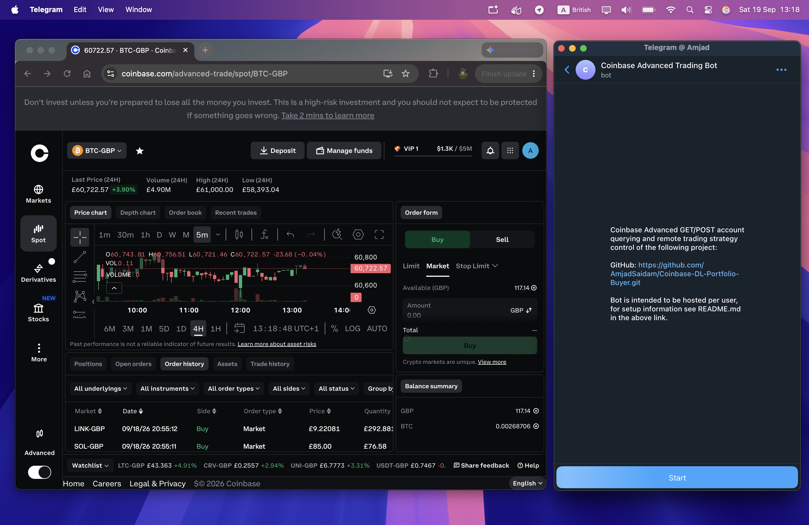

# Deep-Learning Cryptocurrency Trading Bot: DLS-LSTM


This repository focuses on open-sourcing the "DLS" LSTM deep-learning model defined by Zihao Zhang et al in their paper "Deep Learning for Portfolio Optimisation" [1]. The repository contains the full strategy development pipeline (with the exception of the initial idea explored in great detail by authors [1]) from model-building, backtesting, live deployment and live tracking. 




**DISCLAIMER:** THIS REPOSITORY AND ITS CONTENTS DO NOT CONSTITUTE FINANCIAL ADVICE. BEFORE DEPLOYMENT NOTE: THE "DLS-LSTM" MODEL IS "BLACK-BOX", MAKING MODEL PREDICTIONS HIGHLY UN-INTERPRETABLE, FURTHERMORE PREDICTED "OPTIMAL WEIGHT" REBALANCES MAY NOT CONSTITUTE THE BEST PORTFOLIO MANAGEMENT DECISION AT THAT POINT IN TIME DUE TO MODEL ERROR AND ESTIMATE ERROR. TRADED ASSETS (CRYPTOCURRENCIES) ARE HIGHLY VOLATILE AND YOUR PORTFOLIO IS SUBJECT TO THE SAME VOLATILITY AT ALL TIMES DESPITE THE MODEL'S AND REGIME'S BEST EFFORTS AT MINIMISING RISK.  

## Repository Tree

```
coinbase_trading_bot/
├── data/                                # cached OHLCV history pulled from Coinbase, one CSV per asset
│   ├── BTC-GBP_2023-01-01_2026-01-01.csv
│   ├── ETH-GBP_2023-01-01_2026-01-01.csv
│   ├── LINK-GBP_2023-01-01_2026-01-01.csv
│   ├── SOL-GBP_2023-01-01_2026-01-01.csv
│   └── USDT-GBP_2023-01-01_2026-01-01.csv
├── data_loaders/                        # data acquisition, cleaning and feature/label engineering
│   ├── __init__.py                      # package marker (empty)
│   ├── coinbase_data.py                 # pulls raw OHLCV candles from the Coinbase Advanced market API
│   ├── coinbase_data_post_process.py    # standardises downloaded Coinbase data into aligned price/return frames
│   ├── data_to_sql.py                   # writes model/portfolio weight arrays to a SQLite database
│   ├── features_and_labels.py           # rolling volatility and other feature/label construction
│   ├── kaggle_data.py                   # pulls multi-asset historical data from Kaggle for offline backtests
│   └── utils.py                         # shared constants (granularities, seconds-per-candle, etc.)
├── images/
│   └── repo_image.png                   # banner image shown at the top of this README
├── live_trading/                        # live execution pipeline: signal -> order -> logging
│   ├── __init__.py                      # package marker (empty)
│   ├── coinbase_order_functions.py      # order placement/cancellation via the Coinbase Advanced SDK
│   ├── live_errors.py                   # custom exception types for login/data/order failures
│   ├── live_logging.py                  # human-readable .txt logger set-up for live runs
│   └── live_loop.py                     # entrypoint: full live model -> signal -> order pipeline
├── models/                               # DLS-LSTM model definition, training and pre-processing
│   ├── __init__.py                      # package marker (empty)
│   ├── data_preprocessing.py            # padding, standardisation and train/test tensor prep
│   ├── device.py                        # selects cuda / mps / cpu torch device
│   ├── loss_functions.py                # Wasserstein, KL-divergence and Sharpe-ratio losses
│   ├── lstm_trading.py                  # DLS-LSTM model and training loop
│   ├── nn_model.py                      # benchmark FCN model (currently not implemented)
│   ├── training_progress_function.py    # console training-progress printer
│   └── weight_constraint.py             # minimum-rebalance portfolio weight constraint
├── notebooks/
│   ├── backtest_dls.ipynb               # research notebook: DLS-LSTM backtest walkthrough
│   └── unit_testing.ipynb               # scratch notebook for ad-hoc unit testing
├── tests/
│   └── unit_tests.py                    # weight-allocation sanity checks
├── walk_forward_analysis/                # walk-forward training/evaluation used to fit live hyperparameters
│   ├── __init__.py                      # package marker (empty)
│   ├── README.md                        # guide for running run_wfa.py on a rented GPU
│   ├── run_wfa.py                       # walk-forward analysis entrypoint (multiprocessed)
│   └── wfa.pkl                          # pickled WFA results consumed by live_loop.py
├── .dockerignore                         # files excluded from the Docker build context
├── compose.yaml                          # Docker Compose service definitions (telegram_bot, strategy)
├── Dockerfile                            # container build instructions
├── pyproject.toml                        # project dependencies and metadata (uv)
├── README.md                             # you are here
├── shut_down_state.json                  # persisted strategy shutdown state (read/written by the telegram bot)
├── telegram_bot.py                       # Telegram bot: account queries, portfolio actions, shutdown control
└── uv.lock                               # locked dependency versions
```

## Contents

- [Repository Tree](#repository-tree)
- [Features](#features)
- [Setup](#setup)
  - [Pre-Setup](#pre-setup)
  - [1. Choosing a VPS Host](#1-choosing-a-vps-host)
  - [2. Configuring the VPS](#2-configuring-the-vps)
  - [3. Set-up](#3-set-up)
- [Future Updates](#future-updates)
- [Appendix](#appendix)

## Features 

All files intended for live deployment are found in `compose.yaml` under each service heading. Implemented features include

- **DLS-LSTM Portfolio Signal Model:** Creates and rebalances portfolio at specified granularity, `['ONE_MINUTE', 'FIVE_MINUTE', 'FIFTEEN_MINUTE', 'THIRTY_MINUTE', 'ONE_HOUR', 'TWO_HOUR', 'FOUR_HOUR', 'SIX_HOUR', 'ONE_DAY']`, from available asset universe. 

- **Integrated using Coinbase-Advanced:** We use the Coinbase-Advanced API Python SDK [2] which is a wrapper on Coinbase's "Coinbase Advanced Trade API" [3] to link signal generation to order generation. Coinbase is one of the world's largest cryptocurrency exchanges offering great functionality, competitive fee structure and liquid markets. 

- **Regime Signal Guards:** Live behaviour replicates WFA in `walk_forward_analysis/run_wfa.py`, with signal to order logic being gated by a regime designed to minimise rebalances when systemic risk is present in the market.

- **Dynamic Optimisation:** Again, live behaviour replicates WFA, meaning the current DLS-LSTM is trained on new In-Sample (IS) data each Out-Of-Sample (OOS) epoch. Regime hyperparameters are then selected using a grid-search on IS evaluation-set data using the optimal IS training-set model.

- **Live Logging:** Errors, known or unknown, arising from `live_trading/live_loop.py`'s `run_live_loop()` are written to `.txt` human readable format for easy debugging.

- **Database Writing:** Predicted model weights and actual portfolio weights (Predicted vs Actual) are both logged to SQLite type `.db` datasets in the same live_trades database for debugging purposes. 

- **Remote Access Control:** Coinbase account querying, portfolio actions and strategy shutdown all available as commands via telegram bot (designed to be self-hosted).

- **Fully Containerised Applications:** Deployment files are containerised, designed for user hosting on any machine.

## Setup

There is no one-correct way to host deployment. You have to ultimately choose between cloud solutions via a VPS or local hosting e.g. via a pc such as a Raspberry Pi. As of writing I am currently hosting locally on a Raspberry Pi 5, my current set-up can be found here <>. We will proceed with a VPS solution, a more popular and feasible solution. *The following set-up guide will assume you have python and git installed, run ```python --version && git --version``` to confirm* 

### Pre-Setup

This step is required irrespective of your deployment host choice, which concerns making a Coinbase account and creating a valid API Key and API key secret. 

1. Open "Coinbase Developer" platform portal [4]
2. Navigate to "Settings" < "API Keys" < "Create secret API key"
3. Under "Coinbase App & Advanced Trade" under "Portfolio" select "Primary" and check "View" and "Trade"
4. Under "Signature algorithm" select "ECDSA (Legacy SDKs)" and then create and download your keys

Once you have your keys use these to fill out the ".env" variables "LIVE_API_KEY" and "LIVE_API_SECRET".

### 1. Choosing a VPS Host 

There are countless options, although I recommend Microsoft Azure [5] or Amazon's AWS [6], as they both offer free redeemable credits on account creation (terms apply). We will proceed with Microsoft Azure.

### 2. Configuring the VPS

Navigate to "Virtual machines" then click "Create < Virtual machine". The "Create a Virtual Machine" builder will open, the only tabs of importance are "Basics" and "Networking". Configure "Basics" by filling out all requirements, Image and Size are the most important here as this will dictate connection speed and machine performance. For "Image" select any Windows 11 instance, as for "Size" select a "Dc-Series" machine with 8 "RAM (GiB)" and under 100 "Local Storage (GiB)". As for Networking set both "Public IP" and "NIC network security group" to None. This makes your VM only accessible by Bastion (blocking all inbound network traffic, making RDP or SSH redundant).

### 3. Set-up 

Start by cloning the repository

```
path='YOUR_DIRECTORY_PATH' # optional
git clone "https://github.com/AmjadSaidam/Coinbase-DL-Portfolio-Buyer.git" "$path"
cd "$path"
ls -la
```

Install docker in terminal from source 

```
curl -fsSL https://get.docker.com -o get-docker.sh
sudo sh get-docker.sh
sudo usermod -aG docker $USER
newgrp docker # runs docker as a non-privileged user (no need for sudo docker <>)
```

You will need to create the environment file, ```.env``` yourself as this is not committed and tracked in this repo for security (would expose telegram and coinbase-advanced account API keys). Modify the

```
nano .env
```

A file will pop up, copy-paste and edit the following

```
# --- BACKTEST ---
WFA_DOWNLOAD_PATH = '/absolute/path/to/coinbase_trading_bot/data'

# --- LIVE MODEL ---
# keys 
LIVE_API_KEY = ''
LIVE_API_SECRET = ""

# wfa 
LIVE_TIMEFRAME = 'FIVE_MINUTE'
LIVE_WFA_IS_DAYS  = '50'

# model 
LIVE_LSTM_HIDDEN_DIM = '128'
LIVE_LSTM_LOOKBACK = '288'
LIVE_LSTM_VOL_SCALE_WINDOW = '24'
LIVE_LSTM_BATCH_SIZE = '288'
LIVE_LSTM_TRAIN_SPLIT = '0.9' 
LIVE_LSTM_TRAINING_FEES = '0.0016'
LIVE_LSTM_EPOCHS = '20'

# trading
LIVE_PORTFOLIO_MIN_TUROVER = '0.4'

# post-hoc regime 
LIVE_BENCHMARK_WINDOW_DAYS = '40'

# --- TELEGRAM ---
TELEGRAM_TOKEN = ''
TELEGRAM_OWNER_ID = '' # call /start @userinfobot and copy and past numeric user 'id' field
```

To confirm, press ```ctrl/cmd + X``` Then press ```y``` when prompted and ```enter``` to finish. *validate file written at repo root using ```cat .env```*

Then finish by building images and creating/starting containers. By default this will run the .yaml file which reads from the Dockerfile, laying out the instructions for image creation.

```
docker compose up -d
```

## Future Updates

Listed limitations discuss existing features in the code-base I wish to amend in the future, and new features lists features I wish to implement into the codebase. 

**Limitations**

- strategy only compatible with "GBP" quoted pairs [NOT IMPLEMENTED]
- strategy exclusively trades spot pairs only (no perpetual pairs) and as a result no leverage $> 1$; volatility (up) scaling can be applied [NOT IMPLEMENTED]

**New features**

- telegram bot report generating command [NOT IMPLEMENTED]
- telegram bot per-asset liquidation command [NOT IMPLEMENTED]

## Appendix

[1] - [Zhang, Z., Zohren, S. and Roberts, S., 2020. Deep learning for portfolio optimization. arXiv preprint arXiv:2005.13665.](https://arxiv.org/abs/2005.13665)

[2] - [Coinbase Advanced API Python SDK](https://github.com/coinbase/coinbase-advanced-py)

[3] - [Coinbase Advanced Trade API](https://docs.cdp.coinbase.com/api-reference/advanced-trade-api/rest-api/introduction#spot-&-us-derivatives)

[4] - [Coinbase Developer Platform](https://www.coinbase.com/en-gb/developer-platform)

[5] - [Microsoft Azure](https://azure.microsoft.com/en-gb?ocid=cmm4r4ppnhp)

[6] - [AWS](https://aws.amazon.com/free/?trk=f74ff622-b8cd-4d80-9d81-ac330116d817&sc_channel=ps&ef_id=Cj0KCQjw6bfHBhDNARIsAIGsqLhoi9kyT2l9t4vglB2vrkVk3zYvC8ZXIEs4NXpX4dAQJWP9A0RcjiIaAoPxEALw_wcB:G:s&s_kwcid=AL!4422!3!433803620858!e!!g!!aws!1680401428!67152600164&gad_campaignid=1680401428&gbraid=0AAAAADjHtp9KpmNuXk9ADSpjV2HCn8PdT&gclid=Cj0KCQjw6bfHBhDNARIsAIGsqLhoi9kyT2l9t4vglB2vrkVk3zYvC8ZXIEs4NXpX4dAQJWP9A0RcjiIaAoPxEALw_wcB)